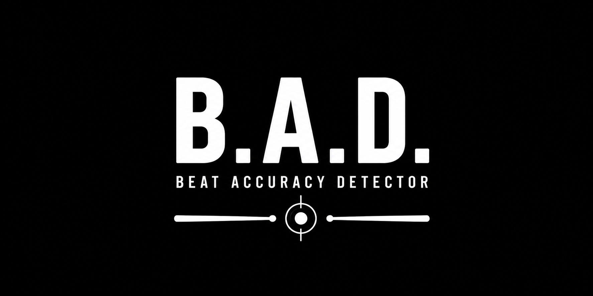

# B.A.D. — Beat Accuracy Detector



> With B.A.D., the beat approves you.

B.A.D. is an Android drum-practice application that will listen to drum or
practice-pad hits, compare them with a rhythmic exercise, and judge whether
each hit was early, on time, late, or missed.

The project is currently an early version 1 prototype. It can select, load,
edit, save, and run a single-lane exercise with a generated metronome and a
scrolling Compose timeline. Practice sessions are captured as WAV audio;
automatic hit detection is not implemented yet.

## Current features

- Versioned, data-driven JSON exercise format
- Separate persisted editable and compiled runtime exercise models
- Validated exercise-library loading and unloading for practice
- Automatic `Download/B.A.D/assets` exercise folder initialization
- Exercise validation with explicit error reporting
- Musical tick-to-time conversion
- Monotonic practice-session clock
- Mandatory one-measure count-in, running, stopped, and completed states
- Generated 48 kHz mono PCM metronome
- Distinct quarter-note count-in and note-driven exercise clicks
- Accented first beat of each measure
- Streaming `AudioTrack` output
- Practice-session microphone capture to 48 kHz mono PCM WAV
- Temporary debug-only in-app recording playback, position, and deletion
- Single-lane scrolling rhythm timeline
- Static first-measure preview while an exercise is idle
- BPM-scaled beat highlights at the judgement line
- Full-screen practice playback with pause, resume, repeat, and stop controls
- Branded adaptive launcher icon and orientation-aware startup screen
- Exercise creation and modification with JSON file creation and overwriting
- Editable rhythmic measure patterns with persisted subdivisions and multipliers
- Purpose-aware exercise library with tap-to-load or tap-to-edit and
  long-press deletion
- Home screen sections for creating or modifying exercises and starting practice
- Collapsible per-exercise playback controls for tempo, measure
  count, and downbeat-only clicks
- Lifecycle-aware playback cleanup
- JVM tests for exercise parsing, validation, timing, and click generation
- GitHub Actions verification with downloadable debug APKs

## Running the app

### Requirements

- Android Studio
- Android SDK 36
- JDK 21, such as Android Studio's bundled runtime
- Android 8.0 (API 26) or newer device

A physical Android device is recommended for evaluating audio and visual
timing. An emulator is sufficient for checking layout and application flow.

## Exercise format

Exercises are versioned JSON documents that can be stored anywhere exposed by
Android's system file picker. A bundled example remains under:

```text
app/src/main/assets/exercises/
```

On Android 10 or newer, the first app launch creates
`Download/B.A.D/assets/` in shared storage and copies
`basic-quarter-notes-v2.json` there when that sample is absent. This seeding runs
only once per installation, so a sample deliberately deleted later is not
recreated. Existing folders and files are never erased or overwritten. Create
and the Exercise Library's Browse file pickers open in this directory by
default while still allowing navigation elsewhere.

Android 8 and 9 use an app-private external-storage fallback because creating a
public Downloads folder would require a runtime storage permission.

Example:

```json
{
  "fileType": "bad-exercise",
  "formatVersion": 2,
  "id": "basic-quarter-notes",
  "name": "Quarter Note Inspection",
  "description": "Four measures of quarter notes.",
  "tempoBpm": 100.0,
  "timeSignature": {
    "numerator": 4,
    "denominator": 4
  },
  "measureCount": 4,
  "ticksPerQuarterNote": 480,
  "measureSubdivisions": [
    "quarter",
    "eighth",
    "eighth_triplet",
    "sixteenth"
  ],
  "measureMultipliers": [
    1,
    1,
    1,
    1
  ],
  "notes": [
    {
      "positionTicks": 0,
      "accent": true
    },
    {
      "positionTicks": 480
    }
  ]
}
```

`fileType` must be `bad-exercise`. It identifies the document before the
remaining exercise structure and musical values are validated.

`ticksPerQuarterNote` defines the musical resolution. At a resolution of 480:

- Quarter note: 480 ticks
- Eighth note: 240 ticks
- Sixteenth note: 120 ticks
- Eighth-note triplet: 160 ticks

`positionTicks` is a musical position measured from the beginning of the
exercise. It is not a timer callback, audio sample index, or stored wall-clock
timestamp.

`measureSubdivisions` stores one display/editing grid per measure. Supported
values are `quarter`, `eighth`, `eighth_triplet`, and `sixteenth`. Older
exercise files without this field remain valid and use `quarter` for every
measure. Changing a subdivision explicitly resets that measure with every slot
in the new grid enabled.

`measureCount` is the number of editable measure patterns.
`measureMultipliers` stores how many consecutive measures each pattern
represents. Existing files without this field default every pattern to `1`.
Each multiplier must be between `1` and `99`; the expanded exercise length is
the sum of all multipliers.

## Project structure

```text
app/src/main/java/com/titaniumharmonics/bad/
├── audio/       Metronome output, WAV recording, and debug playback
├── exercise/    Exercise model, JSON codec, validation, and asset loading
├── timing/      Monotonic clock, musical timing, and session progression
└── ui/
    ├── practice/ Practice ViewModel and Compose UI
    └── theme/    Material theme
```

The exercise, timing, and click-generation logic is kept separate from
Compose and can be tested on the JVM. Validated JSON is decoded into the
persisted `EditableExercise` source of truth. Practice mode compiles it in
memory into an immutable `RuntimeExercise` containing sequential measures and
expected notes with measure-local and absolute tick positions. Timing,
timeline, and metronome code use only this runtime representation; the editor
and storage layers continue to use the persisted representation. Exercise
files are opened and created through Android's Storage Access Framework, so
broad storage permission is not required.

The editor changes the exercise name, BPM, pattern count, each pattern's
persisted multiplier and subdivision, and its note slots. It shows both the
editable pattern count and expanded measure count. Pattern labels use the
expanded indexes, so multipliers `4`, `2`, and `1` produce ranges `1–4`, `5–6`,
and `7`. Each pattern's compact overflow menu supports duplicate, clear, move
up, and move down actions; swipe left continues to expose deletion. Duplicate
copies the complete pattern and multiplier, while Clear explicitly creates a
silent pattern without changing its subdivision or multiplier. New patterns
start at `×1` with all four Quarter slots enabled, and the editor scrolls to
the new pattern after Add Pattern is pressed.
Selecting another subdivision resets that pattern with every new slot enabled;
tapping a slot then enables or disables its expected note. Notes outside the
selected grid remain preserved and produce a warning until an explicit
subdivision reset replaces the pattern. When an existing file is overwritten,
its identifier, description, time signature, and timing resolution
are preserved. Pattern duration comes from the exercise time signature.

When an exercise is loaded for practice, each compact pattern is expanded in
memory into its configured number of flat, sequential runtime measures. The
persisted JSON remains compact. Every repeated note keeps its exact
measure-local tick and receives a new absolute position from its runtime
measure offset, so Quarter, Eighth, Eighth-triplet, and Sixteenth timing remain
exact.

Opening Create or Modify clears the currently loaded in-memory practice
exercise before navigating. Saved exercise files are not changed.

The editor's Play exercise action always saves the current edits first. New
exercises request a destination file, while existing exercises overwrite their
source file. After a successful save, the saved JSON is loaded into Practice
and playback starts with the normal startup delay and count-in. A cancelled or
failed save remains in the editor and does not start playback.

During playback, exercise metronome clicks occur only at exact expected-note
ticks. Disabled notes and empty measures are silent. Every session and resume
uses exactly one measure of Quarter-note count-in clicks with a distinct
higher-pitched sound. Count-in is a playback invariant and is therefore not
stored in exercise JSON. The timeline and visual beat highlights continue
independently so musical time stays visible.

Swiping a measure to the left reveals a red Delete action. Deletion occurs only
after that action is pressed. Notes inside a deleted imported measure are
removed, while notes in later measures shift left to preserve their position
within the remaining measure sequence.

Load and Modify open the same Exercise Library containing only files from the
default folder that pass B.A.D. format and exercise validation. Tapping loads
the selected exercise for Practice or opens it in the editor, according to the
entry point. Pressing and holding requests permanent deletion with
confirmation; the file is revalidated immediately before removal. Browse other
folders keeps the Android document picker available for exercises stored
elsewhere. Each library card shows BPM, compact pattern count, and expanded
measure count.

## Timing model

The exercise stores musical positions rather than elapsed timestamps. During
compilation, a runtime measure starts at
`runtimeMeasureIndex × measureDurationTicks`, and each expected note is placed
at `runtimeMeasureStartTick + positionInMeasureTicks`. At runtime, musical
ticks are converted to nanoseconds from the exercise tempo.

The practice session uses a monotonic clock. The scrolling timeline follows
that clock; Compose animation is not the authoritative timing source.

Metronome clicks are sample-aligned relative to one another. Physical output
latency still depends on the Android device and audio route. Output-latency
calibration has not been implemented yet.

Playback settings can be adjusted while an exercise is idle. They remain in
effect for repeated runs of that exercise and reset when another exercise is
loaded. Longer sessions repeat the exercise pattern; shorter sessions truncate
it at the selected measure boundary. Settings are locked while playback is
preparing, counting in, or running.

Playback settings are collapsed by default. Tapping the exercise information
card toggles them without changing the configured values.

The **First note only** option shows its enabled or disabled state beneath the
label. When enabled, it keeps the full count-in audible, then plays the
metronome only when an expected note is enabled at the beginning of an exercise
measure.

During the exercise, every beat produces a brief green outline ring as it
crosses the judgement line, including beats muted by downbeat-only mode. The
ring follows that beat to the left and lasts for one quarter of the current
beat duration, so it scales with tempo.

The judgement line is centered on the rhythm lane and is ten times the diameter
of the largest note circle rather than spanning the full player height.

While an exercise is idle, the timeline centers the notes from its first
measure as a static musical preview while preserving their relative tick
spacing. The judgement line is hidden in preview mode.

Starting an inspection opens a dedicated full-screen player containing the
timeline, current status, and playback controls. Player text adapts to the
active theme, using white in dark themes and black in light themes. Initial
playback waits two seconds after opening the player before starting the
mandatory one-measure count-in, giving the device time to prepare the screen
and audio path. Pause freezes both metronome audio and monotonic timeline
progress. Resume plays one measure of count-in while the timeline remains
frozen at the paused position, then continues from there. During an initial or
Repeat count-in, the playback timeline waits at one quarter note before
exercise time zero. It begins scrolling during the final quarter note of the
count-in, reaches time zero with the exercise audio, and continues without a
visual jump. Once exercise playback begins, the Player shows the current
one-based measure and total measure count beneath the status. It preserves that
progress while paused or during Resume count-in and shows the final measure on
completion. Stop returns to the exercise settings.

Microphone permission is requested when the app opens if it has not already
been granted, and is checked again before every session. A declined permission
is requested again on the next app launch. Recording starts immediately before
the mandatory count-in, pauses with practice playback, and resumes before the
resume count-in. Natural completion finalizes
`Music/B.A.D/recordings/debug-recording.wav` in app-specific external storage;
stopped, cancelled, or failed sessions discard their partial recording.

Debug builds show a temporary **Debug: Recorded Audio** card after natural
completion. It uses Android `MediaPlayer` to play, pause, stop, replay, or
delete the WAV and shows its current position, duration, and file path. A new
practice session stops debug playback and replaces the previous recording.
Leaving the Practice screen releases both capture and playback resources. The
recording pipeline remains present in release builds, but this playback card is
compiled behind `BuildConfig.DEBUG` and is not shown there.

When microphone detection and hit matching are added, timing feedback will use
a green ring for on-time hits, a blue ring for early hits, and a red ring for
late hits. Missed notes will show a gray `X` at the expected-note position, and
extra hits will show a red `X` at the detected-hit position. Extra hits remain
a distinct result category for accurate session statistics.

## Continuous integration

GitHub Actions runs unit tests, Android lint, and a debug build for pull
requests, pushes to `main`, and manual workflow runs. Successful runs publish
the debug APK for 14 days. Test and lint reports are uploaded even when
verification fails.

## Tests and static checks

Run JVM tests:

```shell
./gradlew testDebugUnitTest
```

Build the debug application:

```shell
./gradlew assembleDebug
```

Run Android lint:

```shell
./gradlew lintDebug
```

## Planned version 1 work

1. Output and microphone latency calibration
2. Energy/envelope-based onset detection
3. Detected-hit to expected-note matching
4. Early, on-time, late, missed, and extra-hit judgements
5. Hit-intensity measurement
6. Immediate visual feedback
7. Practice-session results

Version 1 intentionally uses one generic rhythmic lane. Separate kick, snare,
hi-hat, and tom lanes are future extensions.
